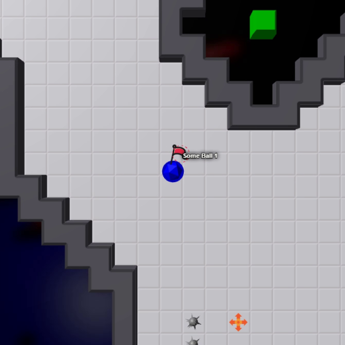

#  TagPro 3D (ALPHA)

This userscript renders your [TagPro](http://tagpro.gg) games in 3D using [THREE.js](http://threejs.org).

## Usage

1. Install [Tampermonkey](https://chrome.google.com/webstore/ail/tampermonkey/dhdgffkkebhmkfjojejmpbldmpobfkfo?hl=en).
2. Click on this link and select "Install": [tagpro-3d.user.js](https://keratagpro.github.io/tagpro-3d/tagpro-3d.user.js).
3. Go play TagPro in 3D!
