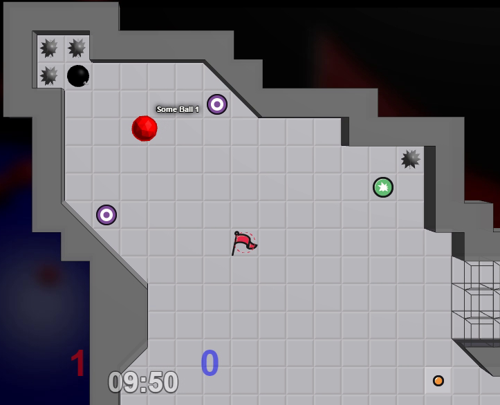

 (ALPHA)

---

This userscript renders your [TagPro](http://tagpro.gg) games in 3D using [THREE.js](http://threejs.org).

## Usage

1. Install [Tampermonkey](https://chrome.google.com/webstore/detail/tampermonkey/dhdgffkkebhmkfjojejmpbldmpobfkfo).
2. Click on this link and select "Install": [tagpro-3d.user.js](https://keratagpro.github.io/tagpro-3d/tagpro-3d.user.js).
3. Go play [TagPro](http://tagpro.gg) in 3D!

## Screenshots



## Development

1. Build userscript

    ```bash
    npm install

    # build once
    npm run build

    # build & watch for changes
    npm run watch
    ```

2. Copy-paste contents of `docs/tagpro-3d.user.js` to TamperMonkey.

## Publish

1. Bump patch/minor/major version

    ```bash
    npm version patch
    ```

2. Build

    ```bash
    npm run build
    # git add -A
    # git commit -m "..."
    ```

3. Push to GitHub

    ```bash
    git push origin
    ```
